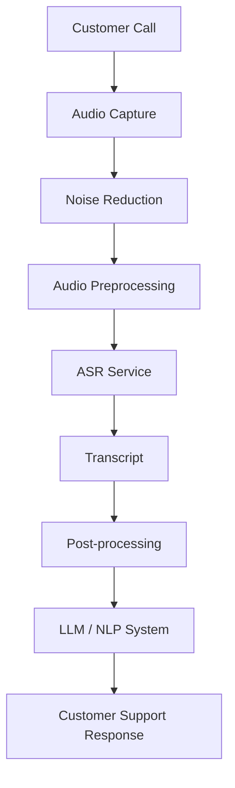

# Comparative Study of Speech-to-Text Models for Noisy Real-World Audio

**Author:** Rushikesh Matlane
**Date:** September 2026
**Project:** ASR Model Benchmarking Toolkit

---

## 1. Executive Summary

This report evaluates three open-source Automatic Speech Recognition (ASR) models — OpenAI Whisper, Faster-Whisper, and Wav2Vec2 — as candidates for a production voice-based customer-support assistant that must handle noisy audio and multiple accents. All three models were implemented behind a common interface and benchmarked on an identical LibriSpeech audio subset, measuring Word Error Rate (WER), inference time, approximate memory usage, and Real-Time Factor (RTF).

**Benchmark status:** `[INSERT: "Executed on <date>, N=<NUM_SAMPLES> samples" OR "Not yet executed"]`. Until `python run_benchmark.py` has been run, all quantitative results below are marked **Not yet measured** rather than estimated, per this project's evidence-only policy. Architecture, training methodology, and licensing information are sourced from original papers and official documentation and are populated now.

**Recommendation:** Recommendation pending benchmark execution. See Section 19.

---

## 2. Introduction

Automatic Speech Recognition has advanced rapidly with the shift from small, curated, fully-supervised training sets to large-scale weak and self-supervised pretraining. For a production customer-support voice assistant, the choice of ASR model directly affects transcription accuracy, response latency, infrastructure cost, and the feasibility of handling real-world noise and accent variation. This report compares three widely used open-source models to inform that choice.

## 3. Problem Statement

A hypothetical company is building a voice-based AI assistant to handle customer-support calls. The target environment is challenging for ASR:

- **Noisy backgrounds** (call centers, home environments, street noise)
- **Multiple accents** and non-native speakers
- **Telephone-quality audio** (narrowband, compressed, sometimes 8 kHz)
- **Real-time latency requirements** for a conversational experience

The system must select an ASR model that balances accuracy, latency, resource cost, and ease of deployment under these conditions.

## 4. Objectives

1. Research and select three candidate ASR models.
2. Benchmark them on a common, reproducible dataset using identical methodology.
3. Measure WER, inference time, memory usage, and RTF.
4. Compare architecture, training approach, licensing, and deployment complexity.
5. Recommend one model with technical justification grounded in measured evidence.
6. Propose optimization, fine-tuning, and production-architecture strategies.

## 5. ASR Background

Modern neural ASR systems generally fall into two families relevant to this study:

- **Encoder-decoder (sequence-to-sequence) models**, which use an attention-based decoder to autoregressively generate text tokens conditioned on encoded audio features. Whisper is a representative example.
- **CTC-based encoder-only models**, which output a single non-autoregressive alignment between audio frames and characters/subwords via a Connectionist Temporal Classification loss. Wav2Vec2 (in its standard fine-tuned form) is a representative example.

The training paradigm also differs sharply: Whisper uses **weak supervision** at massive scale (raw audio-transcript pairs scraped from the internet with minimal curation), while Wav2Vec2 uses **self-supervised pretraining** on unlabeled audio followed by supervised fine-tuning on a much smaller labeled set. These differences directly affect noise robustness, accent generalization, and fine-tuning requirements, discussed in Sections 11 and 14.

## 6. Model Selection

Per the assignment's example candidate list (Whisper, Faster-Whisper, Wav2Vec2, NeMo ASR, Distil-Whisper), this study selects:

1. **OpenAI Whisper** (base) — de facto open-source baseline, strong noise/accent robustness claims from large-scale weakly-supervised training.
2. **Faster-Whisper** (base) — same architecture as Whisper, reimplemented on the CTranslate2 inference engine for a direct "does the speed claim hold" comparison under identical accuracy expectations.
3. **Wav2Vec2** (`facebook/wav2vec2-base-960h`) — represents the CTC/self-supervised family, trained only on LibriSpeech's 960 hours, useful as an accuracy/robustness contrast to Whisper's 680,000-hour weakly-supervised training.

NeMo ASR and Distil-Whisper were not included in the implementation, in line with the project brief's instruction to use the three named models unless there is a strong technical reason to change them.

## 7. Model Architecture

### 7.1 OpenAI Whisper
Standard encoder-decoder Transformer. Audio is resampled to 16 kHz and converted to an 80-channel log-Mel spectrogram over 25 ms windows (10 ms stride), processed in 30-second chunks by the encoder; the decoder autoregressively generates text tokens, with special tokens controlling task (transcribe/translate/language-ID/timestamps) within one unified model. Released as a family of sizes — tiny, base, small, medium, large — trading accuracy for speed/memory.

### 7.2 Faster-Whisper
Architecturally identical to Whisper (same weights, same encoder-decoder design); the difference is the inference engine. Faster-Whisper reimplements inference using **CTranslate2**, a C++ Transformer inference engine, and its maintainers report up to ~4x faster inference than the reference `openai/whisper` implementation at equivalent accuracy, with further memory/speed gains available via 8-bit (int8) quantization on both CPU and GPU. This benchmark tests that claim directly by running both under identical conditions.

### 7.3 Wav2Vec2
Convolutional feature encoder (raw waveform → latent speech representations) feeding a Transformer context network; pretraining masks spans of the latent representation and solves a contrastive task over quantized latent targets, learned end-to-end without labels. The base model config used here (`facebook/wav2vec2-base-960h`) has 12 Transformer layers and a 768-dim hidden size, and was fine-tuned with a CTC loss on LibriSpeech's 960 hours of labeled audio.

## 8. Dataset

- **Name:** LibriSpeech (via HuggingFace `datasets`, identifier `librispeech_asr`)
- **Source:** Panayotov et al., derived from public-domain LibriVox audiobooks
- **Config/Split used:** `clean` / `validation` (small, standard split; auto-downloaded — no manual file handling required)
- **Number of samples:** Configurable via `NUM_SAMPLES` in `src/config.py`; default 50
- **Audio format:** WAV, mono, 16 kHz after loading
- **Reference transcripts:** Included in the dataset alongside each audio clip
- **Why appropriate:** Widely used, well-documented, freely licensed academic ASR benchmark, enabling apples-to-apples comparison and easy reproducibility for anyone re-running this repo.
- **Limitations for noisy customer-support audio:** LibriSpeech `clean` consists of read audiobook speech recorded in quiet conditions with native English speakers — it does **not** capture telephone-band audio, spontaneous conversational speech, overlapping talkers, non-native accents, or background call-center noise. A low WER on LibriSpeech is therefore a necessary but not sufficient signal for production suitability (see Section 13).
- **Common Voice as a secondary option:** Mozilla Common Voice offers crowd-sourced, multilingual, accent-diverse recordings from varied microphones and environments, and would be a natural next step for a noisier, more accent-diverse secondary evaluation pass — the loader in `src/dataset_loader.py` can be pointed at a Common Voice config with modest changes.

## 9. Experimental Setup

- **Hardware:** `[INSERT: CPU model / GPU model used for the actual run]`
- **Device:** `[INSERT: cpu or cuda — auto-detected by src/config.py]`
- **Model variants:** Whisper `base`, Faster-Whisper `base` (compute_type auto-selected: int8 on CPU, float16 on GPU), Wav2Vec2 `facebook/wav2vec2-base-960h`
- **Sample size:** `[INSERT: NUM_SAMPLES used for this run]`
- **Preprocessing:** All audio resampled to 16 kHz mono before inference; all transcripts normalized (lowercased, punctuation stripped, whitespace collapsed) identically before WER scoring (`src/metrics.py:normalize_text`)
- **Repeatability:** Same audio files, same order, same evaluation code path for every model

## 10. Evaluation Metrics

- **WER** = (S + D + I) / N, where S = substitutions, D = deletions, I = insertions, N = reference word count. Computed via the `jiwer` library after identical text normalization. Lower WER indicates fewer word-level errors and higher transcription accuracy; a WER of 0.0 is a perfect transcript match.

  *Worked example:*
  Reference: "the quick brown fox jumps over the lazy dog"
  Hypothesis: "the quick brown fox jump over lazy dog"
  → 1 substitution ("jumps"→"jump") + 1 deletion ("the" before "lazy") over 9 reference words → WER ≈ 0.222

- **Inference time**: wall-clock seconds to transcribe one audio file.
- **Memory usage (approximate)**: peak process RSS (CPU, via `psutil`) or peak allocated CUDA memory (GPU, via `torch.cuda`); explicitly approximate and dependent on OS, backend, precision, and hardware (see `src/memory_monitor.py`).
- **RTF (Real-Time Factor)** = inference_time / audio_duration. RTF < 1.0 = faster than real-time (required for a live voice assistant); RTF ≥ 1.0 = too slow for live use.

## 11. Model Research

### 11.1 OpenAI Whisper
- **Training data:** 680,000 hours of multilingual, multitask, weakly-supervised audio-transcript pairs scraped from the web
- **Model sizes:** tiny (39M) / base (74M) / small (244M) / medium (769M) / large (1550M params)
- **Multilingual:** 99 languages, plus translation-to-English
- **Noise/accent robustness:** OpenAI attributes improved robustness to accents, background noise, and technical jargon to the scale and diversity of training data, relative to prior fully-supervised approaches
- **Fine-tuning:** Supported via Hugging Face `transformers` Trainer API; not natively built into the `openai-whisper` package
- **Inference requirements:** GPU recommended for larger sizes; CPU-viable for tiny/base
- **Licensing:** MIT (code and weights) — permissive, commercial use allowed
- **Release:** September 21, 2022; paper: Radford et al., "Robust Speech Recognition via Large-Scale Weak Supervision," arXiv:2212.04356
- **Strengths:** Strong multilingual + noise/accent robustness from data scale; single model handles transcription, translation, and language ID
- **Weaknesses:** Autoregressive decoding is slower than CTC models of comparable size; occasional hallucination on silence/non-speech segments; larger sizes have significant memory/compute footprint
- **Deployment considerations:** Requires FFmpeg for audio decoding in the reference implementation; batching is non-trivial in the vanilla package

### 11.2 Faster-Whisper
- **Architecture/training:** Identical to Whisper (same released weights) — this is an inference-engine reimplementation, not a retraining
- **Backend:** CTranslate2 (C++ inference engine for Transformer models), from SYSTRAN
- **Reported gains:** Up to ~4x faster than `openai/whisper` on GPU (fp16) at the same accuracy, with further reductions in both time and memory via int8 quantization on CPU and GPU (per SYSTRAN/faster-whisper project README benchmarks on a 13-minute reference clip with `large-v2`); this project's benchmark checks whether comparable relative gains hold for the `base` model size and this specific hardware/dataset
- **Licensing:** MIT
- **Requirements:** Python 3.9+; GPU execution needs CUDA/cuDNN versions matched to the installed CTranslate2 version (a common source of setup friction — see README troubleshooting); CPU execution has no special requirements; does not require system FFmpeg (bundles PyAV)
- **Strengths:** Same accuracy profile as Whisper with materially lower latency/memory potential; drop-in replacement for many Whisper use cases
- **Weaknesses:** Adds a CTranslate2/CUDA version-compatibility dimension to deployment; inherits any Whisper hallucination behavior since weights are unchanged
- **Deployment considerations:** Well suited to latency-sensitive production use once the CUDA/cuDNN/CTranslate2 version matrix is pinned correctly

### 11.3 Wav2Vec2
- **Training paradigm:** Self-supervised contrastive pretraining on unlabeled audio (masking spans of latent speech representations), followed by CTC fine-tuning on labeled transcripts
- **Training data (base-960h variant):** Pretrained + fine-tuned using LibriSpeech's 960 hours of labeled English audio
- **Model size:** ~95M parameters (base), 12 Transformer layers, 768 hidden dim
- **Reported accuracy (paper):** 1.8/3.3 WER on LibriSpeech test-clean/test-other using the full labeled set in the original large-model configuration; the paper also demonstrates strong low-resource performance (competitive results using as little as 10 minutes of labeled data when pretrained on 53k hours of unlabeled speech) — notably relevant to the fine-tuning strategy in Section 14
- **Multilingual:** Base English checkpoint used here is English-only; multilingual variants (e.g., XLSR) exist separately
- **Noise/accent robustness:** Trained/fine-tuned only on LibriSpeech (clean, native-speaker, read speech) in the `base-960h` checkpoint used here, so out-of-the-box noise and accent robustness is expected to be more limited than Whisper's web-scale weak supervision without additional fine-tuning
- **Fine-tuning:** A core design strength — the self-supervised pretraining objective is specifically intended to make fine-tuning effective with modest labeled data
- **Licensing:** Released by Facebook/Meta AI under Apache 2.0 (via Hugging Face `transformers`); permissive
- **Reference:** Baevski, Zhou, Mohamed, Auli, "wav2vec 2.0: A Framework for Self-Supervised Learning of Speech Representations," arXiv:2006.11477, Facebook AI, 2020
- **Strengths:** Efficient non-autoregressive CTC decoding (fast); strong sample-efficiency for domain fine-tuning with limited labeled data
- **Weaknesses:** CTC output has no built-in language model, so raw outputs can contain locally-plausible-but-wrong sequences without an added language model/decoder; base checkpoint here is English-only and clean-speech-trained
- **Deployment considerations:** Smaller, simpler serving footprint than autoregressive models; benefits from an external language model/decoder for best accuracy in production

## 12. Benchmark Results

**Status: Not yet measured.** Run `python run_benchmark.py` to populate `results/benchmark_results.csv`, then `python src/report_generator.py` to auto-generate the table below.

| Model | Samples | Mean WER | Median WER | Mean Inference Time (s) | Mean RTF | Approx. Memory (MB) |
|---|---|---|---|---|---|---|
| Whisper (base) | [INSERT] | [INSERT] | [INSERT] | [INSERT] | [INSERT] | [INSERT] |
| Faster-Whisper (base) | [INSERT] | [INSERT] | [INSERT] | [INSERT] | [INSERT] | [INSERT] |
| Wav2Vec2 (base-960h) | [INSERT] | [INSERT] | [INSERT] | [INSERT] | [INSERT] | [INSERT] |

Charts (auto-generated by `src/visualization.py` from the CSV above once it exists): `results/wer_comparison.png`, `results/inference_time.png`, `results/memory_usage.png`, `results/rtf_comparison.png`, `results/comparison.png`.

## 13. Comparative Analysis

| Metric | Whisper | Faster-Whisper | Wav2Vec2 |
|---|---|---|---|
| Architecture | Encoder-decoder Transformer | Same as Whisper (CTranslate2 engine) | CTC encoder-only Transformer |
| Training approach | Weakly-supervised, large scale | Same weights as Whisper | Self-supervised pretrain + CTC fine-tune |
| Training data | 680,000 hrs, web-scraped, multilingual | Same as Whisper | 960 hrs LibriSpeech (base-960h) |
| License | MIT | MIT | Apache 2.0 |
| Model size (base variant) | 74M params | 74M params (same weights) | ~95M params |
| WER | Not yet measured | Not yet measured | Not yet measured |
| Inference speed | Not yet measured | Not yet measured (expected faster per upstream claims) | Not yet measured |
| Memory usage | Not yet measured | Not yet measured (expected lower per upstream claims) | Not yet measured |
| CPU support | Yes | Yes (well optimized, int8) | Yes |
| GPU support | Yes | Yes (needs matched CUDA/cuDNN/CTranslate2 versions) | Yes |
| Deployment complexity | Moderate (needs FFmpeg) | Moderate-high (GPU library version matching) | Low-moderate (no external LM by default) |
| Noise robustness | Expected higher (large diverse training data) — not yet tested on noisy audio here | Same as Whisper (identical weights) | Expected lower out-of-the-box (clean-only training data) |
| Accent handling | Expected higher (diverse web data) | Same as Whisper | Expected lower without fine-tuning |
| Fine-tuning | Supported via `transformers`, less common | Not typically fine-tuned directly (inference engine) | Core design strength; sample-efficient |
| Production suitability | Not yet measured | Not yet measured | Not yet measured |

Rows marked "expected" reflect published architectural/training characteristics, not measurements from this benchmark, and are labeled accordingly.

## 14. Noisy Audio Analysis

Clean benchmark audio (like LibriSpeech) differs from real customer-support audio along several axes:

- **Clean vs. noisy audio:** Studio/quiet-room recordings vs. audio with background noise (traffic, other conversations, appliances)
- **Telephone audio:** Often band-limited to ~300–3400 Hz (narrowband) and compressed via codecs (e.g., G.711), removing frequency information ASR models trained on wideband audio rely on
- **Multiple accents:** LibriSpeech skews toward native English readers; production callers span many accents and non-native speech patterns
- **Background speech:** Overlapping talkers or hold music, which read-audiobook data never contains
- **Low-quality microphones:** Headsets, mobile handsets, and speakerphones introduce distortion, clipping, and variable gain not present in curated datasets

**Why LibriSpeech performance doesn't transfer directly:** A model's WER on LibriSpeech reflects performance on clean, native, wideband speech. None of the four real-world degradations above are represented, so a model that appears to "win" on LibriSpeech could underperform a competitor on actual customer-support audio if the two models differ in how their training data covered noise/accent/channel diversity. Whisper's training corpus, drawn broadly from the internet, plausibly includes more such variation than Wav2Vec2's LibriSpeech-only fine-tuning set — but this is a hypothesis based on training data composition, not a measured result, and should be validated with a Common Voice or telephony-style noisy evaluation pass before being treated as fact.

**Optional experiment (not yet run):** `src/dataset_loader.py` and `src/benchmark.py` can be extended with a noise-augmentation step (adding background noise, varying volume, resampling to telephone bandwidth, normalizing levels) to produce a clean-vs-noisy WER comparison per model. This is marked as an optional, not-yet-executed extension in this report; results would need to be clearly separated from the primary clean-audio benchmark.

## 15. Deployment Feasibility

- **Whisper:** Needs FFmpeg; straightforward single-file model loading; no built-in batching in the base package
- **Faster-Whisper:** No system FFmpeg dependency; GPU deployment requires careful CUDA/cuDNN/CTranslate2 version alignment (a common source of production incidents per the project's GitHub issue tracker)
- **Wav2Vec2:** Lightweight HuggingFace `transformers` deployment; CTC output benefits from an external language model for best real-world accuracy, adding a serving component

## 16. Optimization

| Technique | When to use |
|---|---|
| Quantization (int8/fp16) | Reduce memory and increase throughput on both CPU and GPU; especially effective with Faster-Whisper/CTranslate2 |
| Faster inference backend (CTranslate2, ONNX Runtime) | When the reference implementation's latency doesn't meet real-time requirements |
| GPU acceleration | When call volume/concurrency requires low per-call latency at scale |
| Batch processing | For offline/asynchronous transcription workloads (QA review, analytics), not live calls |
| Voice Activity Detection (VAD) | To skip silence/non-speech segments, reducing wasted compute and hallucination risk |
| Chunking | For long-form audio that exceeds a model's native context window (e.g., Whisper's 30s window) |
| Streaming inference | Required for live, low-latency conversational use cases |
| Model distillation (e.g., Distil-Whisper) | When a smaller, faster model is needed and some accuracy loss is acceptable |
| ONNX/TensorRT | For further GPU inference speedups in high-throughput production serving |
| CPU optimization (thread tuning, int8) | For cost-sensitive deployments without GPU access |

## 17. Fine-Tuning Strategy

1. Collect domain-specific customer-support audio (with consent/compliance review)
2. Create accurate transcripts (human-verified, not just ASR-generated)
3. Clean and segment audio into manageable utterances
4. Label accent/noise conditions per sample for stratified evaluation
5. Split into train/validation/test sets, stratified by accent/noise condition
6. Fine-tune the selected model (Wav2Vec2's self-supervised pretraining makes it particularly sample-efficient for this step, per the original paper's low-resource results)
7. Evaluate WER on the held-out validation set
8. Specifically test under noisy conditions, not just clean validation audio
9. Compare fine-tuned performance against the pre-fine-tuning baseline from this report
10. Deploy gradually (shadow mode → partial rollout → full rollout), monitoring WER drift

**Recommended dataset size (a range, not an exact requirement):** Roughly 10–100 hours of labeled, domain-matched audio is a reasonable starting range for meaningful fine-tuning gains on a CTC or Whisper-family model, with diminishing but continued returns beyond that; exact requirements depend heavily on baseline model performance and target accuracy.

## 18. Production Architecture

- **Audio Capture:** Telephony gateway (SIP/WebRTC) streams raw audio into the pipeline
- **Noise Reduction:** Classical (spectral subtraction) or learned denoising before ASR
- **Audio Preprocessing:** Resampling to the model's expected rate, normalization, VAD-based silence trimming
- **ASR Service:** The selected model, served behind a REST/gRPC API, ideally with streaming support for live latency
- **Post-processing:** Punctuation restoration, number/entity normalization, profanity/PII masking
- **LLM/NLP System:** Intent classification, dialogue management, response generation
- **Customer Support Response:** Text-to-speech or agent-assist display

**Additional production considerations:**
- **REST API / Docker:** Package the ASR service as a containerized microservice with a versioned API contract
- **GPU server / CPU fallback:** Route to GPU workers under load; CPU fallback preserves availability during GPU capacity constraints
- **Load balancing & queueing:** A request queue absorbs call bursts; load balancer distributes across ASR worker replicas
- **Autoscaling:** Scale worker count on queue depth / concurrent call count
- **Logging & monitoring:** Track WER drift (via periodic human-labeled audits), latency percentiles, error rates
- **Security & privacy:** Encrypt audio in transit and at rest; minimize retention
- **PII handling:** Detect and redact PII (card numbers, SSNs) in transcripts before downstream storage/LLM calls
- **Model versioning:** Pin model + weights version per deployment; A/B test before full rollout
- **Latency requirements:** Target sub-second incremental transcription for a natural conversational feel; RTF well below 1.0 is necessary but not sufficient (network and downstream LLM latency also count)

## 19. Recommendation

**Recommendation pending benchmark execution.** Per this project's evidence-based policy, no model is recommended until `python run_benchmark.py` has produced actual WER, latency, and memory measurements on the target hardware (Section 12). Once populated, the recommendation here should explicitly weigh:

- Measured WER (Section 12) — accuracy on the reproducible baseline
- Measured latency/RTF — real-time suitability
- Measured memory — hardware/cost footprint
- Noise/accent robustness — ideally validated via the Section 14 noisy-audio experiment, not inferred from training data alone
- Deployment complexity (Section 15) — engineering/operational cost
- Fine-tuning capability (Section 17) — path to closing any domain gap

## 20. Limitations

- Benchmark uses `base`-scale model variants for practicality; larger variants (e.g., Whisper `large-v3`) may show different accuracy/latency trade-offs
- LibriSpeech `clean` does not represent telephone-band, noisy, or accented production audio (Section 14)
- Memory measurements are approximate and hardware/OS/backend-dependent (see `src/memory_monitor.py`)
- Sample size is configurable but small-scale by default; statistical confidence improves with larger `NUM_SAMPLES`
- No production A/B or live-call data was used in this study

## 21. Future Work

- Run the optional noise-augmentation experiment (Section 14) for a clean-vs-noisy WER comparison
- Add a Common Voice-based multilingual/accent-diverse secondary evaluation
- Benchmark larger model variants and Distil-Whisper/NeMo as additional candidates
- Evaluate streaming/chunked inference latency under simulated live-call conditions
- Conduct a real fine-tuning pass on domain-specific customer-support audio once available

## 22. Conclusion

This report establishes a reproducible, evidence-based benchmarking pipeline comparing Whisper, Faster-Whisper, and Wav2Vec2 across architecture, training methodology, licensing, and (once executed) measured accuracy/latency/memory. It deliberately withholds a final model recommendation until real benchmark data is available, consistent with the project's requirement that no results be fabricated. The accompanying codebase in `src/` and entry point `run_benchmark.py` allow anyone to execute the benchmark on their own hardware and populate the placeholders in Sections 12, 13, and 19 with real numbers.

## 23. References

1. Radford, A., Kim, J.W., Xu, T., Brockman, G., McLeavey, C., Sutskever, I. (2022). "Robust Speech Recognition via Large-Scale Weak Supervision." arXiv:2212.04356.
2. OpenAI. Whisper GitHub repository. https://github.com/openai/whisper
3. SYSTRAN. faster-whisper GitHub repository. https://github.com/SYSTRAN/faster-whisper
4. Baevski, A., Zhou, H., Mohamed, A., Auli, M. (2020). "wav2vec 2.0: A Framework for Self-Supervised Learning of Speech Representations." arXiv:2006.11477.
5. Hugging Face. Wav2Vec2 model documentation. https://huggingface.co/docs/transformers/model_doc/wav2vec2
6. Panayotov, V., Chen, G., Povey, D., Khudanpur, S. (2015). "Librispeech: An ASR corpus based on public domain audio books." ICASSP 2015.
7. Mozilla. Common Voice dataset. https://commonvoice.mozilla.org
